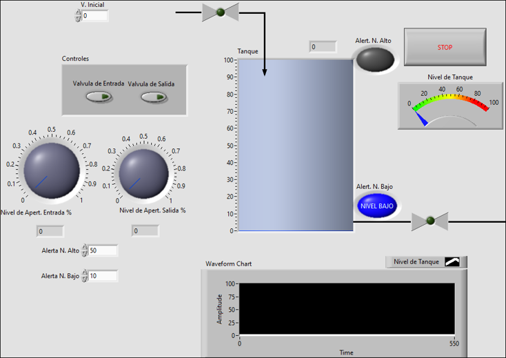
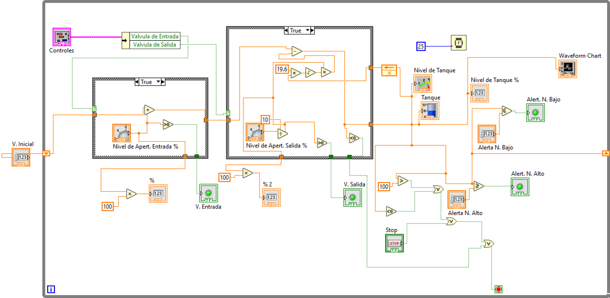
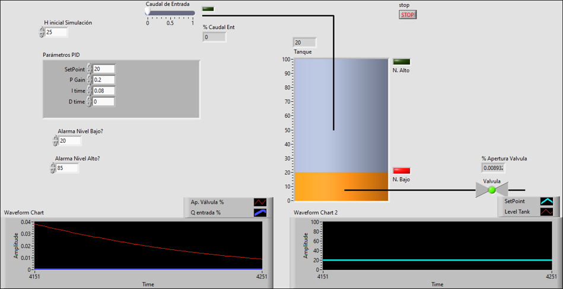
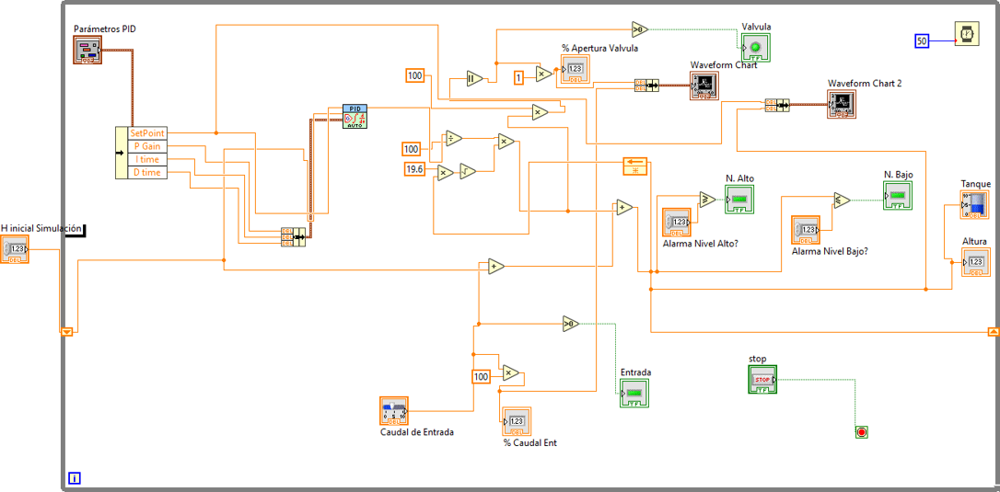
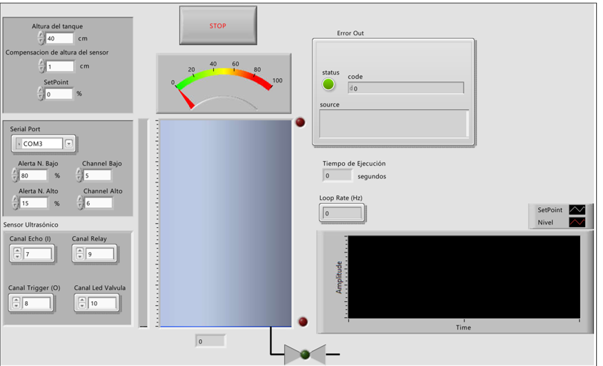
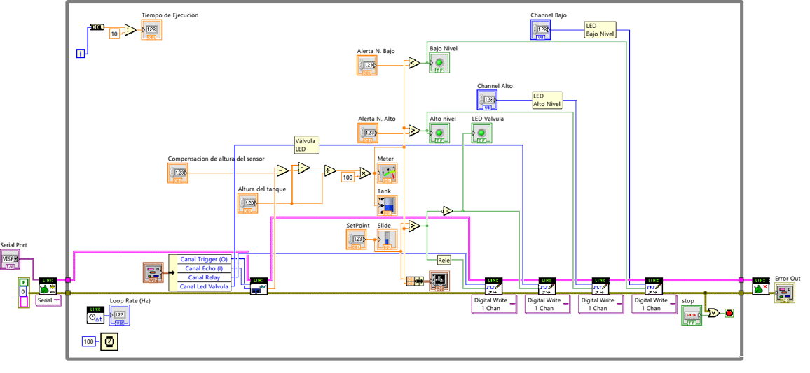
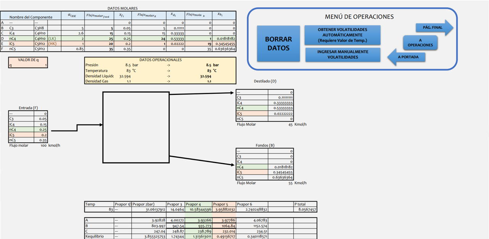
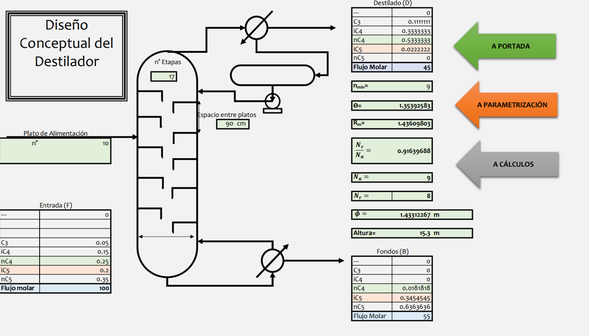

# Gas Process Automation & Engineering Portfolio 🛢️⚙️

📌 Overview

This repository hosts my capstone engineering projects focusing on Process Control, Automation, and Chemical Engineering Simulation.

It demonstrates the full engineering lifecycle: from mathematical modeling of fluid dynamics to closed-loop PID control and final hardware deployment using SCADA interfaces.

🚀 Project 1: Automated Tank Level Control System (SCADA)

Tech Stack: LabView (G-Code), Arduino (C++), NI VISA.

This project implements a hydrodynamic control system in three evolutionary phases:

Phase 1: Mathematical Modeling (Open Loop)

Development of a dynamic simulation based on Bernoulli's Principle to validate the physical behavior of tank discharge rates without automatic control.

Phase 2: PID Control Algorithm (Closed Loop)

Implementation of a custom PID (Proportional-Integral-Derivative) algorithm designed from scratch in LabView.

Features: Real-time error calculation (SP - PV), dynamic gain tuning, and disturbance rejection.

Phase 3: Hardware Integration (SCADA)

Final deployment interfacing LabView with an Arduino Uno via Serial/VISA protocols.

DAQ: Real-time ultrasonic sensor data acquisition.

Actuation: PWM control of the pump to maintain tank levels within 1% of the Setpoint.

⚗️ Project 2: FUG Gas Fractionation Calculator

Tech Stack: Microsoft Excel, VBA (Visual Basic for Applications).

A robust simulation tool automating the Fenske-Underwood-Gilliland (FUG) shortcut method for designing multicomponent distillation columns.

Automation: Iterative calculation of minimum reflux ratio ($R_{min}$) and theoretical stages ($N$).

UX/UI: Custom UserForm for component selection and operational parameters.

Validation: Benchmarked against standard literature for hydrocarbon separation.

🛠️ How to Run

LabView Simulation

Ensure NI LabView 2020 (or later), NI-VISA and MakerHub Yoolkit drivers are installed.

Open labview/main_scada.vi.

For hardware mode: Connect Arduino to COM port and upload arduino_code.ino.

FUG Calculator

Open fug_simulation/FUG_Calculator_v1.xlsm.

Enable Macros when prompted by Excel.

Click "Start Simulation" on the main dashboard.

👨‍💻 Author

Gabriel Astudillo Gas Engineer | Automation Specialist

LinkedIn Profile: https://www.linkedin.com/in/gcav1072/
